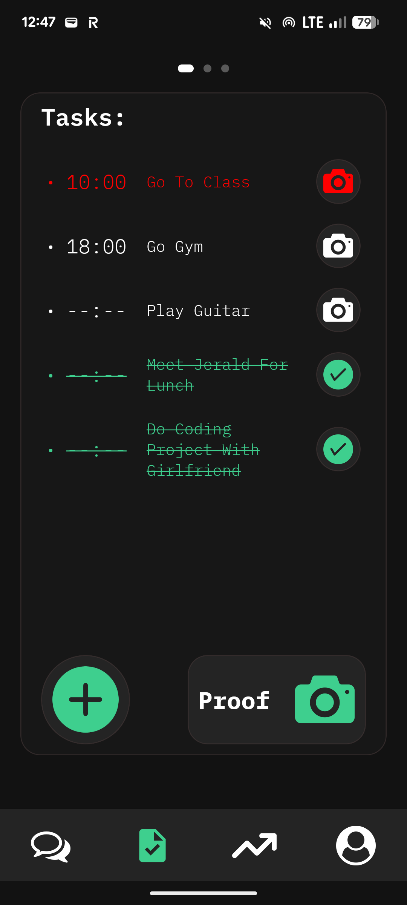
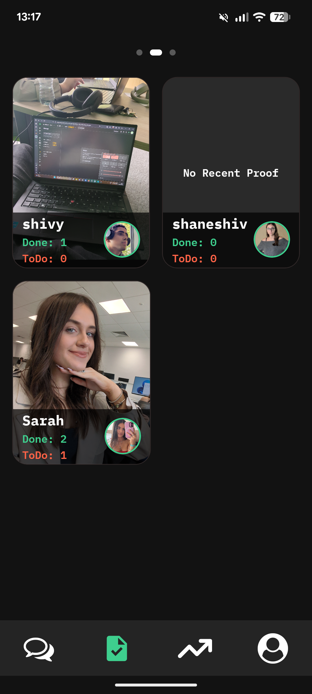
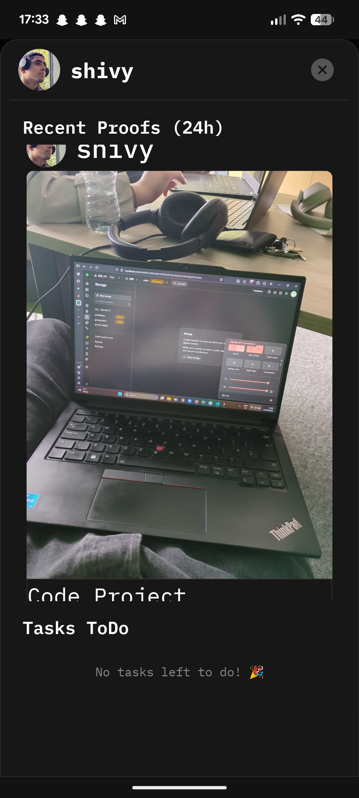
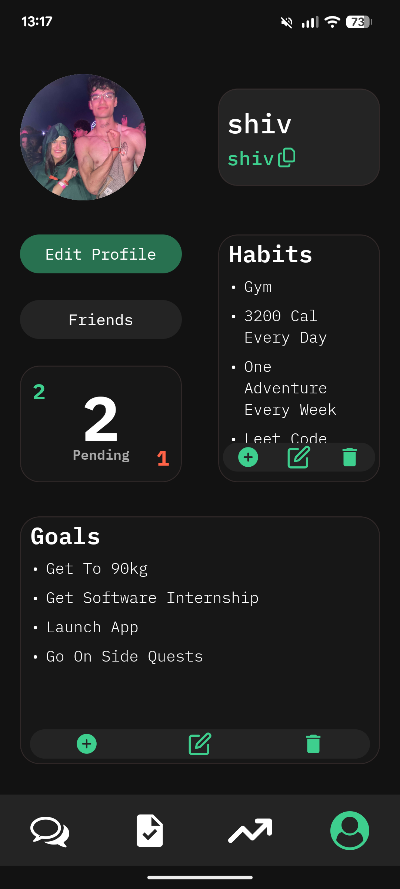
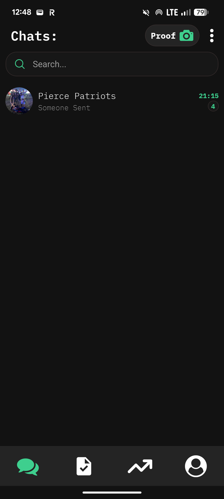
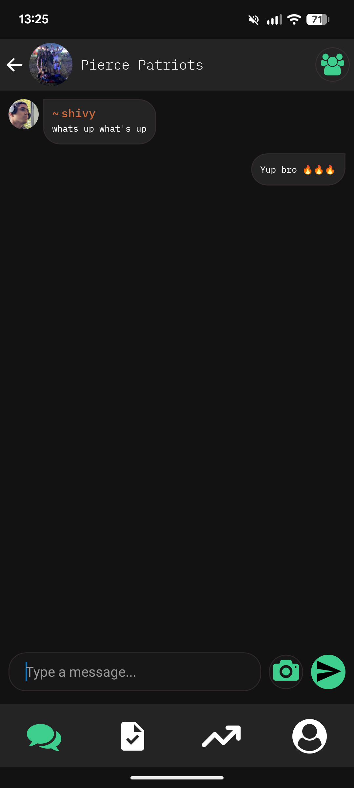
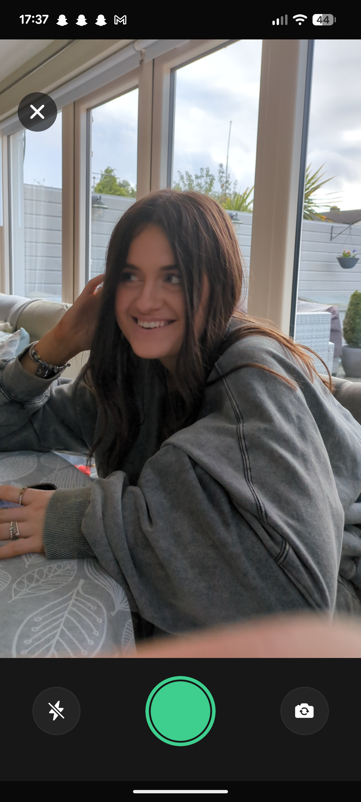
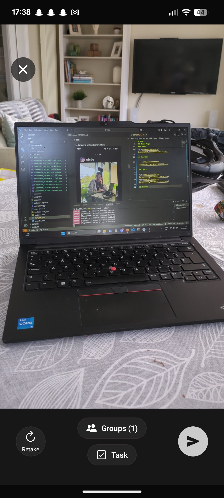

# SBR

Full stack app using epxo go for front end and supabase for back end.

## Task Page

### Personal Tasks

View tasks add tasks and take proofs of tasks

### Friend ToDo's

Can click on friend cards to see what tasks they hav left to do and what tasks they have done.

### Feed
Feed showing all friends shared tasks

## Profile

## Chats

## Camera

